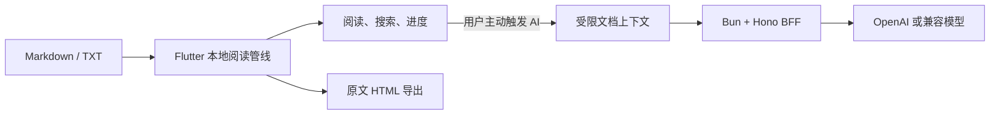

<div align="center">
  
  <h1>Atlas</h1>
  <p><strong>把散落在聊天、网盘和仓库里的 Markdown / TXT，变成一段可以继续的阅读。</strong></p>
  <p>本地优先 · 为手机而生 · AI 只在你需要理解时出现</p>
  <p>
    <a href="https://github.com/KlayPeter/Atlas/releases"></a>
    <a href="https://github.com/KlayPeter/Atlas/blob/main/LICENSE"></a>
    
    
    <a href="CONTRIBUTING.md"></a>
  </p>
  <p>
    <strong>简体中文</strong> · <a href="README_en.md">English</a>
  </p>
  <p>
    <a href="docs/installation.md"><strong>下载与安装</strong></a>
    ·
    <a href="#自己部署-ai-后端"><strong>自己部署</strong></a>
    ·
    <a href="CONTRIBUTING.md"><strong>参与贡献</strong></a>
  </p>
</div>

> Atlas 不是 Markdown 编辑器，也不想成为另一个知识库。它只专注一件常被忽略的事：**当一份文本已经来到你手里，帮你顺畅地读完、读懂，再带走。**

## Atlas 想解决什么

Markdown 很适合写作和版本管理，却很少为手机阅读优化；TXT 到处都能打开，但标题、代码、引用和上下文往往挤成一面文字墙。遇到难懂内容时，我们又要复制片段、切换 AI 工具、重新解释背景，阅读节奏就此中断。

Atlas 把这条断裂的链路接起来：

```text
打开本地文件 → 恢复上次位置 → 搜索与按目录阅读 → 划词解释 / 全文问答 → 导出并分享 HTML
```

它不要求你先上传到云端、整理进知识库或改造成某种专有格式。文件仍是你的文件，AI 是阅读动作的一部分，而不是阅读的入口。

## 该APP可以做什么

### 安静地读

- 导入 Markdown 与 TXT，并在本地保存副本；按文件内容去重，保留最近阅读记录。
- 自动生成目录，保存阅读进度，重新打开时回到上次位置。
- 支持全文搜索、结果定位、代码高亮、表格横向滚动和 Mermaid 图表。
- 提供浅色、深色、护眼纸色，以及字号、行距和页边距调节。
- Android 可从文件管理器、聊天应用或分享菜单把文本交给 Atlas。

### 在原文旁边理解

- 划选一段文字，直接解释或翻译，不用离开阅读器。
- 基于文档上下文总结全文、提问，并以流式响应显示答案。
- 保存 AI 阅读历史，支持重新生成。
- 进入学习模式，按难度生成问题、作答、查看参考答案并自评。
- 在 App 内配置自己的 API Key、OpenAI 兼容 Base URL、模型和 Atlas BFF 地址；敏感值写入系统安全存储。

### 把内容带走

- 在本地把原始 Markdown / TXT 转成独立 HTML，预览后通过系统分享。
- 可选 AI 可读版：补充导读、摘要、关键概念、章节说明和复习问题。
- 长文按片段处理，避免只看开头；原文模式无需 AI 后端。

## 本地优先，不是“完全离线”的话术

Atlas 把阅读主流程放在设备上。只有当你主动触发 AI 功能时，App 才把完成任务所需的受限上下文发给 Atlas BFF。

| 留在设备上 | 主动使用 AI 时发送 |
| --- | --- |
| 原始文件副本、解析与渲染 | 标题、目录与受限的正文片段 |
| 最近阅读与阅读进度 | 划选内容、问题或任务类型 |
| 阅读设置与原文 HTML 导出 | 你选择的模型配置请求头 |

BFF 只负责鉴权、输入校验、模型调用和统一响应，不拥有阅读状态。请求日志记录方法、路径、状态码和耗时，不记录文档正文。



## 下载与安装

详细步骤见 [下载与安装页面](docs/installation.md)。

- **Android**：本地 release APK 构建链已验证。公开签名版将在 [GitHub Releases](https://github.com/KlayPeter/Atlas/releases) 提供；当前仓库尚未发布首个 Release。
- **iOS**：可从源码构建。系统分享导入还需要补齐原生 Share Extension，暂未提供 TestFlight 或 App Store 版本。

从源码构建 Android：

```bash
git clone https://github.com/KlayPeter/Atlas.git
cd Atlas/apps/atlas_app
flutter pub get
flutter build apk --release
```

APK 输出到 `apps/atlas_app/build/app/outputs/flutter-apk/app-release.apk`。当前模板使用 debug 签名生成 release 构建，仅适合本地测试；公开分发前请配置独立 Android 签名。

## 自己部署 AI 后端

不使用 AI 时，Atlas 的阅读、搜索、进度和原文 HTML 导出都可独立工作。需要 AI 功能时，可以部署仓库内的 Bun + Hono BFF。

### 1. 启动服务

```bash
git clone https://github.com/KlayPeter/Atlas.git
cd Atlas/services/atlas_bff
bun install
cp .env.example .env
bun run typecheck
bun run start
```

开发环境至少配置：

```dotenv
APP_ENV=development
HOST=127.0.0.1
PORT=8787
OPENAI_API_KEY=your-api-key
OPENAI_MODEL=gpt-4.1-mini
```

检查服务：

```bash
curl http://127.0.0.1:8787/health
```

### 2. 连接 App

在 Atlas「设置 → AI 模型配置」中填写 BFF 地址。Android 模拟器访问宿主机通常使用 `http://10.0.2.2:8787`，iOS 模拟器通常使用 `http://127.0.0.1:8787`。

也可以在构建时指定默认地址：

```bash
flutter run --dart-define=ATLAS_BFF_URL=http://127.0.0.1:8787
```

生产部署必须使用 HTTPS，并设置 `APP_ENV=production`、`OPENAI_API_KEY` 和至少 32 个字符的 `ATLAS_BFF_ACCESS_TOKEN`。App 中的「BFF 访问令牌」需要与服务端一致。若允许用户自带 OpenAI 兼容 Base URL，还需配置 `AI_PROVIDER_BASE_URL_ALLOWLIST`。

## 项目结构

```text
apps/atlas_app/       Flutter 客户端：导入、阅读、进度、AI 交互、HTML 导出
services/atlas_bff/   Bun + Hono BFF：鉴权、校验、模型调用、流式响应
docs/                 安装说明、MVP 验证材料与示例文档
skills/               Atlas 的 Markdown → HTML 辅助技能
```

Flutter 客户端使用 Riverpod 管理共享状态、`go_router` 管理路由；BFF 使用 Zod 校验输入，并统一返回 `{ ok, data }` / `{ ok, error }`。

## 当前状态

Atlas 已完成本地导入、阅读、搜索、进度、AI 阅读助手、学习模式和 HTML 导出的 MVP 闭环。首个公开版本前仍有两项明确工作：配置正式 Android 签名并发布 Release、补齐 iOS Share Extension。

Atlas 暂时不做复杂编辑器、跨端同步、插件系统或重型知识库。先把“打开一份文本并真正读进去”做到足够好。

## 参与贡献

Bug、交互改进、渲染兼容、测试和文档贡献都欢迎。请先阅读 [贡献指南](CONTRIBUTING.md)，其中包含项目边界、开发环境、检查命令和 Pull Request 清单。

## 许可证

Atlas 采用 [MIT License](LICENSE)。你可以使用、复制、修改、分发和商业使用本项目，但需保留原始版权与许可证声明。
