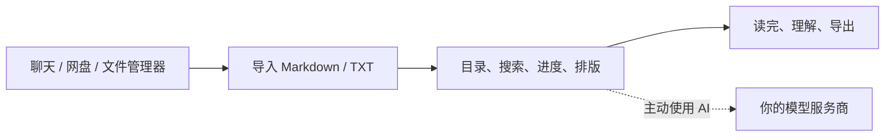

<p align="center">
  
</p>

<h1 align="center">Atlas</h1>

<p align="center">
  <strong>把收到的 Markdown / TXT，读完。</strong><br>
  本地导入 · 手机上继续阅读 · 用自己的 AI Key 理解难句
</p>

<p align="center">
  <a href="https://github.com/KlayPeter/Atlas/releases"></a>
  <a href="https://github.com/KlayPeter/Atlas/stargazers"></a>
  <a href="LICENSE"></a>
  
</p>

<p align="center">
  <a href="#30-秒上手">30 秒上手</a> ·
  <a href="#配置自己的-ai">配置 AI</a> ·
  <a href="docs/installation.md">安装说明</a> ·
  <a href="CONTRIBUTING.md">参与贡献</a> ·
  <a href="README_en.md">English</a>
</p>

---

## 不是编辑器，是阅读器

你在聊天、网盘或代码仓库里收到一份 `.md` 或 `.txt`。它能打开，却未必适合在手机上读：标题挤在一起，代码块难看，读到一半又忘了进度。

Atlas 只解决这件事：**把本地文本变成一段能在手机上继续读下去的阅读。**



## Atlas 能做什么

| 你要做的事 | Atlas 怎么做 |
| --- | --- |
| 打开本地 Markdown / TXT | 从文件选择器或 Android 分享菜单导入，副本留在 App 沙盒 |
| 接着上次读 | 保存最近阅读和滚动位置，重新打开自动恢复 |
| 快速找到内容 | 自动目录、全文搜索、结果定位 |
| 读技术内容 | 代码高亮、表格横向滚动、Mermaid 图表、深浅色与护眼主题 |
| 看懂难句 | 划词解释/翻译、全文总结、基于文档的问答、学习模式 |
| 把内容带走 | 本地导出原文 HTML；可选生成 AI 易读版 |

## 30 秒上手

1. 从 [Releases](https://github.com/KlayPeter/Atlas/releases) 下载 Android APK；尚未发布正式包时，按 [安装说明](docs/installation.md) 从源码构建。
2. 打开 Atlas，点击“打开文件”，选择 `.md`、`.markdown` 或 `.txt`。
3. 直接开始读。目录、搜索、进度和原文 HTML 导出均不需要账号、云端或 AI Key。

## 配置自己的 AI

Atlas 不运营公共 AI 服务，也不替你保管模型 Key。你带自己的 Key，直接连接自己的模型服务商。

在 **设置 → AI 模型** 填写：

| 字段 | 填什么 |
| --- | --- |
| API Key | 模型服务商给你的密钥 |
| Base URL | 该服务商的 OpenAI 兼容接口地址，通常以 `/v1` 结尾 |
| 模型名称 | 这个 Key 可以调用的模型名 |

随后可以使用划词解释、翻译、总结、问答、学习模式和 AI 易读版 HTML。

> API Key 只存放在系统安全存储。你主动触发 AI 时，Atlas 会把完成该任务所需的文档片段直接发送给你填写的模型服务商；请求不经过 Atlas 运营的服务器。请只使用你信任的服务商，并了解其数据处理规则。

没有配置 AI，Atlas 依然是完整的离线阅读器。

## 为什么选择本地优先

- 文件不上传到 Atlas；导入后由 App 保存本地副本。
- 阅读、解析、搜索、进度和原文 HTML 转换全部在设备上完成。
- AI 不是阅读的前提，只在你点击解释、总结或问答时才出现。
- 没有账号体系、同步系统或公共模型账单。

## 从源码运行

```bash
git clone https://github.com/KlayPeter/Atlas.git
cd Atlas/apps/atlas_app
flutter pub get
flutter analyze
flutter run
```

构建 Android APK：

```bash
flutter build apk --release
```

完整的 Android、iOS、签名与安装说明见 [docs/installation.md](docs/installation.md)。

## 项目结构

```text
apps/atlas_app/       Flutter 客户端：导入、阅读、AI 直连、HTML 导出
services/atlas_bff/   可选的自部署 BFF 示例；当前客户端不依赖它
docs/                 产品、安装与开发文档
```

Atlas 使用 Flutter、Riverpod、go_router 和 OpenAI 兼容 Chat Completions API。

## 路线图

- [x] 本地导入、阅读、目录、搜索与进度
- [x] 划词解释、翻译、总结、问答与学习模式
- [x] 原文 HTML 导出与 AI 易读版
- [ ] 正式 Android 签名与首个 GitHub Release
- [ ] iOS Share Extension、TestFlight 与 App Store 分发

不在近期计划内：复杂编辑器、跨端同步、插件系统和重型知识库。先把“打开一份文本并读进去”做扎实。

## 贡献

欢迎提交 Bug、渲染兼容、交互细节、测试和文档改进。请先阅读 [贡献指南](CONTRIBUTING.md)。

## License

[MIT](LICENSE)
