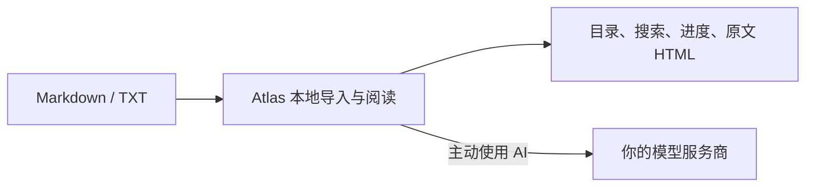

# Atlas

Atlas 是一个手机上的 Markdown / TXT 阅读器。

打开本地文件，继续上次阅读，搜索内容，或在读不懂时让你自己的 AI 模型解释。阅读、进度和原文 HTML 导出都留在设备上；AI 仅在你主动使用时直连你配置的模型服务商。

[下载与安装](docs/installation.md) · [配置自己的 AI](#配置自己的-ai) · [参与贡献](CONTRIBUTING.md) · [English](README_en.md)

## 适合什么场景

- 从聊天、网盘或文件管理器打开 Markdown 和 TXT。
- 在手机上阅读技术文章、笔记、会议纪要和学习资料。
- 保留阅读进度、目录、搜索、代码块、表格和 Mermaid 图表。
- 划词解释或翻译；基于全文总结、问答和学习复习。
- 导出适合分享的原文 HTML，或生成 AI 易读版。

Atlas 不是编辑器、知识库或同步盘。它只把一份已经在你手里的文本读得更舒服。

## 使用方式

1. 安装 Atlas，点击“打开文件”，或从其他应用的分享菜单选择 Atlas。
2. 导入 `.md`、`.markdown` 或 `.txt` 文件。
3. 阅读、搜索和原文 HTML 导出无需网络。
4. 第一次使用解释、总结、问答、学习模式或 AI 易读版时，按提示配置自己的模型。

## 配置自己的 AI

Atlas 不提供公共 AI 服务，也不收集你的模型 Key。

在“设置 → AI 模型”中填写：

- **API Key**：你向模型服务商申请的密钥。
- **Base URL**：该服务商提供的 OpenAI 兼容接口地址，例如以 `/v1` 结尾的地址。
- **模型名称**：该 Key 有权调用的模型名。

Key 只保存到系统安全存储。触发 AI 功能时，Atlas 会把完成任务所需的文档片段直接发送给你选择的模型服务商；它不会经过 Atlas 运营的服务器。请只为你信任的服务商填写 Key，并了解其数据处理规则。

没有配置模型时，Atlas 仍是完整的离线阅读器。



## 下载与构建

正式签名的 Android 安装包会发布在 [GitHub Releases](https://github.com/KlayPeter/Atlas/releases)。首个 Release 发布前，也可以从源码构建：

```bash
git clone https://github.com/KlayPeter/Atlas.git
cd Atlas/apps/atlas_app
flutter pub get
flutter analyze
flutter build apk --release
```

更多 Android、iOS 和正式签名说明见 [下载与安装](docs/installation.md)。

## 项目结构

```text
apps/atlas_app/       Flutter 客户端：导入、阅读、AI 直连、HTML 导出
services/atlas_bff/   可选的自部署 BFF 示例，不是客户端运行所必需
docs/                 产品、安装和开发文档
```

Flutter 客户端使用 Riverpod 管理共享状态、`go_router` 管理路由。AI 直连层支持 OpenAI 兼容的 Chat Completions 接口。

## 当前状态

MVP 已包括本地导入、阅读、搜索、进度、AI 阅读助手、学习模式和 HTML 导出。公开发布前还需要配置正式 Android 签名，并完成 iOS 的分发与分享导入支持。

## 参与贡献

欢迎提交 Bug、渲染兼容、交互、测试和文档改进。开始前请阅读 [贡献指南](CONTRIBUTING.md)。

## 许可证

Atlas 使用 [MIT License](LICENSE)。
