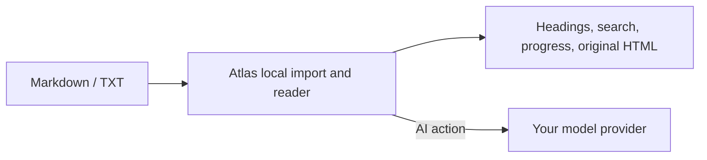

# Atlas

Atlas is a Markdown and TXT reader for phones.

Open a local file, resume where you stopped, search it, and ask your own AI model for help when a passage is hard to understand. Reading, progress, and original HTML export stay on the device. AI requests go directly to the provider you configure.

[Download and install](docs/installation_en.md) · [Configure your AI](#configure-your-own-ai) · [Contributing](CONTRIBUTING.md) · [简体中文](README.md)

## What Atlas is for

- Open Markdown and TXT from chats, cloud drives, and file managers.
- Read technical articles, notes, meeting minutes, and study material on a phone.
- Keep reading progress; browse headings; search; read code, tables, and Mermaid diagrams.
- Explain or translate a selection; summarize, ask questions about, and study a document.
- Export original HTML for sharing, or generate an AI-assisted readable version.

Atlas is not an editor, knowledge base, or sync drive. It helps you read a file you already have.

## How it works

1. Install Atlas, tap “Open file,” or share a file to Atlas from another app.
2. Import a `.md`, `.markdown`, or `.txt` file.
3. Reading, search, and original HTML export work offline.
4. Before using explanation, summary, Q&A, study mode, or AI-readable HTML, configure your own model once.

## Configure your own AI

Atlas does not run a public AI service or collect your model key.

Open **Settings → AI model** and enter:

- **API key** from your model provider.
- **Base URL** for its OpenAI-compatible API, usually an address ending in `/v1`.
- **Model name** that your key can use.

Atlas stores the key in the platform secure store. When you trigger an AI action, it sends only the document context needed for that action directly to your configured provider; no Atlas-operated server sits in between. Use providers you trust and review their data policies.

Without a model configuration, Atlas remains a complete offline reader.



## Download and build

Production-signed Android packages will be published through [GitHub Releases](https://github.com/KlayPeter/Atlas/releases). Until the first release, build from source:

```bash
git clone https://github.com/KlayPeter/Atlas.git
cd Atlas/apps/atlas_app
flutter pub get
flutter analyze
flutter build apk --release
```

See [Download and install](docs/installation_en.md) for Android, iOS, and release-signing notes.

## Repository layout

```text
apps/atlas_app/       Flutter client: import, reading, direct AI, HTML export
services/atlas_bff/   Optional self-hosted BFF example; not required by the client
docs/                 Product, installation, and development documentation
```

The Flutter client uses Riverpod for shared state and `go_router` for navigation. Its direct AI layer supports OpenAI-compatible Chat Completions APIs.

## Status

The MVP includes local import, reading, search, progress, AI reading help, study mode, and HTML export. Before public distribution, Atlas still needs production Android signing and iOS distribution/share-import work.

## Contributing

Bug reports, rendering compatibility fixes, interaction improvements, tests, and documentation are welcome. Read the [contribution guide](CONTRIBUTING.md) before starting.

## License

Atlas is available under the [MIT License](LICENSE).
