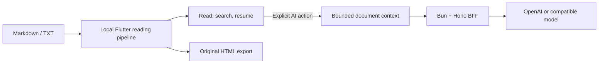

<div align="center">
  
  <h1>Atlas</h1>
  <p><strong>Turn Markdown and TXT scattered across chats, drives, and repositories into reading you can actually continue.</strong></p>
  <p>Local-first · Built for phones · AI appears only when understanding needs help</p>
  <p>
    <a href="https://github.com/KlayPeter/Atlas/releases"></a>
    <a href="https://github.com/KlayPeter/Atlas/blob/main/LICENSE"></a>
    
    
    <a href="CONTRIBUTING.md"></a>
  </p>
  <p>
    <a href="README.md">简体中文</a> · <strong>English</strong>
  </p>
  <p>
    <a href="docs/installation_en.md"><strong>Download & install</strong></a>
    ·
    <a href="#self-host-the-ai-backend"><strong>Self-host</strong></a>
    ·
    <a href="CONTRIBUTING.md"><strong>Contribute</strong></a>
  </p>
</div>

> Atlas is not a Markdown editor, and it does not want to become another knowledge base. It focuses on one neglected moment: **once a document reaches you, help you finish it, understand it, and take it with you.**

## The problem Atlas tackles

Markdown works well for writing and version control, but rarely reads well on a phone. TXT opens everywhere, yet headings, code, quotes, and context collapse into a wall of text. When a passage becomes difficult, copying it into a separate AI tool breaks the reading flow and strips away context.

Atlas reconnects that flow:

```text
Open a local file → resume your position → search or follow the outline → explain / ask → export and share HTML
```

You do not need to upload a document first, organize it into a cloud workspace, or convert it to a proprietary format. Your file remains a file. AI supports the reading action instead of becoming the entrance to it.

## What works today

### Read without friction

- Import Markdown and TXT, keep a local copy, deduplicate by content, and maintain a recent-reading library.
- Generate an outline, save reading progress, and return to the previous position.
- Search the full document with result navigation; render highlighted code, scrollable tables, and Mermaid diagrams.
- Adjust light, dark, and paper themes, plus font size, line height, and page margins.
- On Android, open text from file managers, chat apps, and the system share sheet.

### Understand beside the source

- Select text and explain or translate it without leaving the reader.
- Summarize the document or ask contextual questions with streaming answers.
- Keep AI reading history and regenerate a result.
- Enter study mode to generate questions by difficulty, write an answer, reveal the reference answer, and self-rate.
- Configure your API key, OpenAI-compatible base URL, model, and Atlas BFF endpoint in the app. Secrets use platform secure storage.

### Take the result with you

- Convert the original Markdown or TXT to a standalone HTML file locally, preview it, and share it through the system sheet.
- Optionally generate a readable AI edition with a lead, summary, concepts, section notes, and review questions.
- Process long documents in distributed chunks instead of reading only the beginning. Original-mode export needs no AI backend.

## Local-first, stated precisely

Atlas keeps the reading loop on the device. Only an explicit AI action sends the bounded context required for that task to the Atlas BFF.

| Stays on the device | Sent after an explicit AI action |
| --- | --- |
| Original file copy, parsing, and rendering | Title, outline, and bounded text segments |
| Recent library and reading progress | Selected text, question, or task type |
| Reading preferences and original HTML export | Your chosen model configuration headers |

The BFF handles authentication, input validation, model calls, and the response envelope. It does not own reading state. Request logs contain method, path, status, and duration—not document bodies.



## Download and install

See the [download and installation page](docs/installation_en.md) for complete instructions.

- **Android:** the local release APK build is verified. Public, signed packages will appear on [GitHub Releases](https://github.com/KlayPeter/Atlas/releases); the repository has not published its first release yet.
- **iOS:** source builds are available. Native Share Extension work remains, and no TestFlight or App Store package is available today.

Build Android from source:

```bash
git clone https://github.com/KlayPeter/Atlas.git
cd Atlas/apps/atlas_app
flutter pub get
flutter build apk --release
```

The APK appears at `apps/atlas_app/build/app/outputs/flutter-apk/app-release.apk`. The current template signs release builds with the debug key for local testing. Configure a dedicated Android signing key before public distribution.

## Self-host the AI backend

Reading, search, progress, and original HTML export work without AI. To enable AI features, deploy the Bun + Hono BFF included in this repository.

### 1. Start the service

```bash
git clone https://github.com/KlayPeter/Atlas.git
cd Atlas/services/atlas_bff
bun install
cp .env.example .env
bun run typecheck
bun run start
```

Minimum development configuration:

```dotenv
APP_ENV=development
HOST=127.0.0.1
PORT=8787
OPENAI_API_KEY=your-api-key
OPENAI_MODEL=gpt-4.1-mini
```

Check the service:

```bash
curl http://127.0.0.1:8787/health
```

### 2. Connect the app

Enter the BFF address under Atlas **Settings → Custom AI configuration**. An Android emulator usually reaches the host at `http://10.0.2.2:8787`; the iOS Simulator usually uses `http://127.0.0.1:8787`.

You can also set the default address at build time:

```bash
flutter run --dart-define=ATLAS_BFF_URL=http://127.0.0.1:8787
```

Production deployments must use HTTPS and set `APP_ENV=production`, `OPENAI_API_KEY`, and an `ATLAS_BFF_ACCESS_TOKEN` of at least 32 characters. Enter the same token in the app. If clients may supply an OpenAI-compatible base URL, configure `AI_PROVIDER_BASE_URL_ALLOWLIST` too.

## Repository layout

```text
apps/atlas_app/       Flutter client: import, reader, progress, AI UI, HTML export
services/atlas_bff/   Bun + Hono BFF: auth, validation, model calls, streaming
docs/                 Installation, MVP verification, and sample documents
skills/               Atlas Markdown-to-HTML helper skills
```

The Flutter client uses Riverpod for shared state and `go_router` for navigation. The BFF validates inputs with Zod and returns `{ ok, data }` / `{ ok, error }` envelopes.

## Project status

Atlas has completed its MVP loop: local import, reading, search, progress, contextual AI, study mode, and HTML export. Two items remain before the first public release: production Android signing and a GitHub Release, plus the iOS Share Extension.

Atlas deliberately avoids a complex editor, cross-device sync, a plugin system, and heavy knowledge-base features for now. The first goal is to make opening a text file and truly reading it feel complete.

## Contributing

Bug fixes, interaction improvements, rendering compatibility, tests, and documentation are welcome. Read the [contribution guide](CONTRIBUTING.md) for project boundaries, setup, required checks, and the pull request checklist.

## License

Atlas is available under the [MIT License](LICENSE). You may use, copy, modify, distribute, and sell the software while preserving the copyright and license notice.
